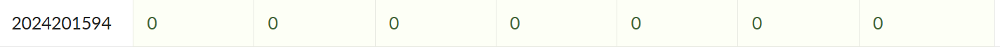

# bomblab 报告

姓名：张三

学号：2000000000

| 总分 | phase_1 | phase_2 | phase_3 | phase_4 | phase_5 | phase_6 | secret_phase |
| ---- | ------- | ------- | ------- | ------- | ------- | ------- | ------------ |
| 3    | 1       | 1       | 1       | 0       | 0       | 0       | 0            |


scoreboard 截图：



<!-- TODO: 用一个scoreboard的截图，本地图片，放到 imgs 文件夹下，不要用这个 github，pandoc 解析可能有问题 -->

## 解题报告

<!-- 对你拆掉的每个phase进行分析，并写出你得出答案的历程 -->

<!-- 如果能用伪代码还原题目源代码最佳（不属于先前提到的大段代码），语言描述自己的分析也可，每道题目的图片不建议超过两张 -->

### phase_1

#### 答案
```c
But when anger's bottled up inside, can I resist against unspoken words or try to hide?
```
#### C语言伪代码
```c
int phase_1(const char *input) {
	const char *secret = "But when anger's bottled up inside, can I resist against unspoken words or try to hide?";
	// 要求：输入字符串与内存中的secret完全相同
	if (strcmp(input, secret) != 0) {
		explode_bomb();
		return -1;
	}
	return 0; // 通过
}
```
#### 思路
将输入的字符串与内存中的一个字符串进行比较，相同则返回0，若未返回0炸弹爆炸。因此取出内存中对应的字符串即可完成这个phase。

### phase_2
#### 答案
```c
415515 527717 439252 655784
```
#### C语言伪代码
```c
int phase_2(const int a, const int b, const int c, const int d) {
	// 1) 检查是否提供了四个整数

	// 2) 将四个输入按“从顶到底”的顺序入栈
	int s[8];
	s[0] = a; // top
	s[1] = b;
	s[2] = c;
	s[3] = d; // bottom

	// 3) 两轮循环，每一轮计算两个数，结果依次压在输入四数的“下方”
	int s[4] = compute_x(1); // 415515
	int s[5] = compute_x(1); // 527717
	int s[6] = compute_x(2); // 439252
	int s[7] = compute_x(2); // 655784

	// 4) 逐个移动指针比较：若不相同则爆炸
	if (s[0] != s[4] || s[1] != s[5] || s[2] != s[6] || s[3] != s[7]) {
		explode_bomb();
		return -1;
	}
	return 0; // 通过
}
```
#### 思路
首先程序会检查你是不是输入了四个数，如果数量小于4炸弹就会爆炸。接着这四个数按从顶到底的顺序入栈用于后续的比较。然后是两轮循环，每一轮计算出两个数。这四个数按照从顶到底的顺序放到输入的四个数正下方（这里的下方是从栈的角度讲的）。接着移动指针逐个比较，数值不相同炸弹就会爆炸。因此我要做的就是取出中间计算出的这四个数的值作为输入。

### phase_3

#### 答案
```c
5 -627
```
#### 转化为C语言代码
```c
int phase_3(unsigned int x1, int x2) {
	// 1) 输入必须是两个整数
	
	// 2) 限制条件：x1 <= 7（无符号）；x2 < 0（有符号）
	if (x1 > 7u || x2 >= 0) {
		explode_bomb();
		return -1;
	}

	// 3) 根据x1进行switch跳转（间接跳转）
	switch (x1) {
		case 0:
		case 1:
		case 2:
		case 3:
		case 6:
		case 7:
			explode_bomb();
			return -1;
		case 4:
			if (x2 != -627) {
				explode_bomb();
				return -1;
			}
			break;
		case 5:
			// 题面推导为要求x2 == 0（但同时要求x2 < 0故不可行）；因此该分支也爆炸
			explode_bomb();
			return -1;
		default:
			// 不会到达，因为x1>7时前面已爆炸
			explode_bomb();
			return -1;
	}

	return 0; // 通过（仅当x1==4且x2==-627）
}
```
#### 思路
首先程序会检查你是不是输入了两个整数，不是的话就会爆炸。假如这两个数按输入顺序分别为x~1~和x~2~，程序会检查它们各自的大小，无符号x~1~应当小于等于7，有符号x~2~应当小于0。满足第一步的条件后会计算出一个地址存到rax寄存器中，并跳转到这个地址执行相应的操作。这部分是一种`Switch`结构，在x~1~的值为0，1，2，3，6，7时都会让炸弹爆炸，在x~1~为4时检验x~2~的值是否为-627，如果x~2~ = -627那么炸弹就不会爆炸，在x~1~为5时要求x~2~的值为0，这显然是不可能的。因此相应的输入也就很明确了。

### phase_4

#### 答案
```c
31 BA
```
#### C语言伪代码
```c
int func4_1(int n){
	if(n<=0) return 0;
	if(n==1) return 1;
	return 2*func4_1(n-1)+1; // T(n)=2^n-1
}

// 递归生成两个字符
void func4_2(int n,int value,int chA,int chB,int chC,char *out){
	if(n==1){
		out[0]=(char)chA; out[1]=(char)chB; out[2]='\0';
		return;
	}
	int x = func4_1(n-1); // x = 2^{n-1}-1
	if(x < value){
		if(x + 1 == value){ // 命中边界直接输出
			out[0]=(char)chA; out[1]=(char)chB; out[2]='\0';
			return;
		}
		// 右侧区间：缩减 value 并循环 (A,B,C)->(B,C,A)
		func4_2(n-1, value - x - 1, chB, chC, chA, out);
	} else {
		// 左侧区间：保持 value 并重排 (A,B,C)->(C,A,B)
		func4_2(n-1, value, chC, chA, chB, out);
	}
}

int phase_4(const char *line){
	char str[16];
	int num;
	if(sscanf(line, "%15s %d", str, &num) != 2){ explode_bomb(); return -1; }
	if(num != func4_1(5)){ explode_bomb(); return -1; } // 必须是31
	if(strlen(str) != 2){ explode_bomb(); return -1; }
	char target[3];
	func4_2(5, 29, 'A','C','B', target); // 29 = 0x1d
	if(strcmp(str, target)!=0){ explode_bomb(); return -1; }
	return 0; // 通过，合法输入: "BA 31"
}
```

#### 思路
程序首先用 `sscanf` 解析一行，要求提取出一个两字符字符串和一个整数，解析失败直接爆炸。第二步检查整数是否等于 `func4_1(5)`。根据递归关系 `T(1)=1, T(n)=2*T(n-1)+1` 推得闭式 `T(n)=2^n-1`，因此 `func4_1(5)=31`，若不等则爆炸；再检查字符串长度必须恰好为 2。随后调用 `func4_2(5, 29, 'A','C','B')` 生成目标两字符。`func4_2` 以 `x=func4_1(n-1)` 将区间分成左右：若 `x<value` 进入右侧（可能再缩减 `value` 并循环字符三元组 `(A,B,C)->(B,C,A)`），若 `x>=value` 进入左侧（保持 `value` 并重排 `(A,B,C)->(C,A,B)`）。具体递归展开：
1. (5,29, A,C,B) ：x=15 <29 ⇒ 右侧 newValue=13, 字符→(C,B,A)
2. (4,13, C,B,A) ：x=7 <13 ⇒ 右侧 newValue=5,  字符→(B,A,C)
3. (3,5,  B,A,C) ：x=3 <5  ⇒ 右侧 newValue=1,  字符→(A,C,B)
4. (2,1,  A,C,B) ：x=1 >=1 ⇒ 左侧保持 value=1, 字符→(B,A,C)
5. (1,1,  B,A,C) 终止，输出 "BA"
所以目标字符串是 "BA"，合法输入即 `BA 31`。任一检查不满足即触发 `explode_bomb()`。
## 反馈/收获/感悟/总结

<!-- 这一节，你可以简单描述你在这个 lab 上花费的时间/你认为的难度/你认为不合理的地方/你认为有趣的地方 -->

<!-- 或者是收获/感悟/总结 -->

<!-- 200 字以内，可以不写 -->

## 参考的重要资料

<!-- 有哪些文章/论文/PPT/课本对你的实现有重要启发或者帮助，或者是你直接引用了某个方法 -->

<!-- 请附上文章标题和可访问的网页路径 -->
